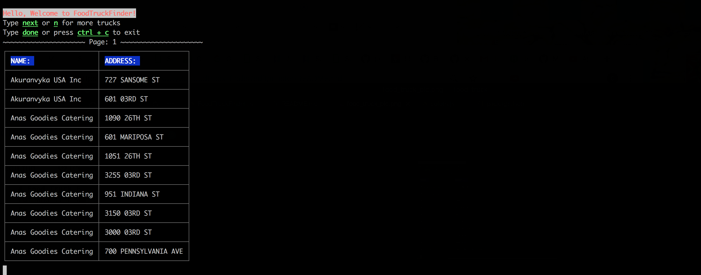

# Food Truck Finder
Command line app that tells you what food trucks are available at that time of day.



## Basic Setup

### Clone source locally:
to run locally, install node & npm.
```
$ git clone https://github.com/BigNatty35/foodtruck-finder.git
$ cd foodtruck-finder-master
```

### Install dependencies:

```
$ npm install
```

### How to run application:

First:
```
$ npm start
```
this will start the app.
You will be greeted with instructions on how to find a food truck.

It's that easy!


### Converting to a Scalable Web Application

If I were to build this into a web-application a few things I would take into consideration would be scalability, routing and caching data. Assuming multiple users across San Francisco would be using the app at once, I would want to make a request for open food trucks once every 30-45mins and cache those results to prevent unnecessary requests. I would also need to set up a server and routes to deal with requests coming from the client side. Based on the request from the client, I would need to set up routers to handle the incoming traffic, and controllers to house the logic that determines what kind of data to send back. As far as scalability goes, I would have multiple servers handling the requests that come in from users, and a load balancer that makes sure the requests are distributed evenly amongst the servers.
