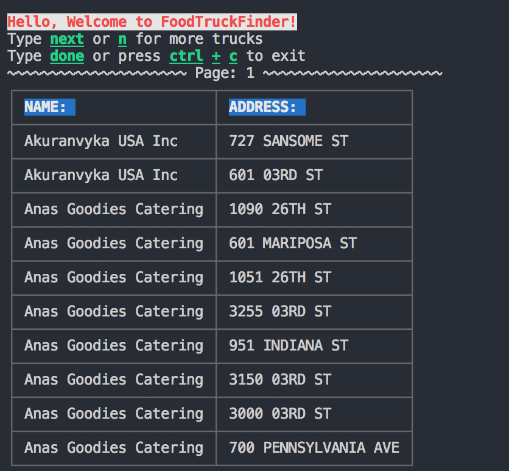

# Food Truck Finder
Command line app that tells you what food trucks are available at that time of day.
Example:

## Basic Setup

### Clone source locally:
```
$ git clone https://github.com/BigNatty35/foodtruck-finder.git
$ cd foodtruck-finder-master
```

### Install dependencies:

```
$ npm install colors cli-table request
```

### How to run application:

First:
```
$ npm start
```
this will start the app.
You will be greeted with instructions on how to find a food truck.

It's that easy!
